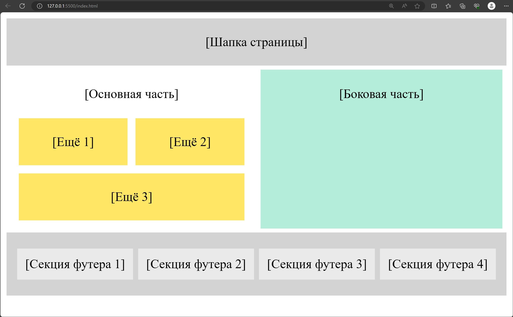
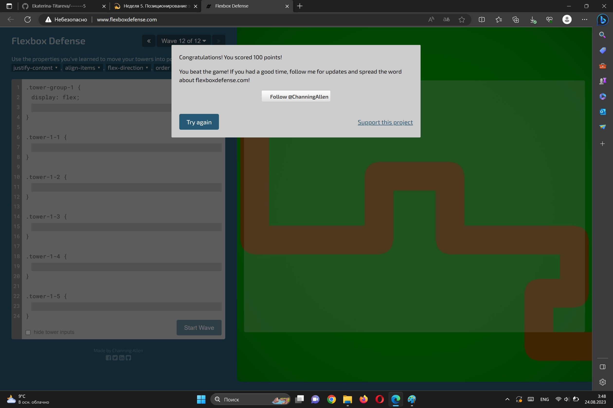
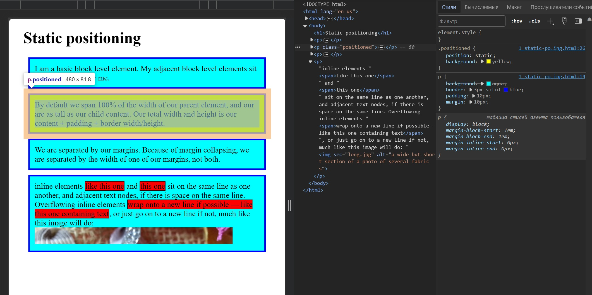
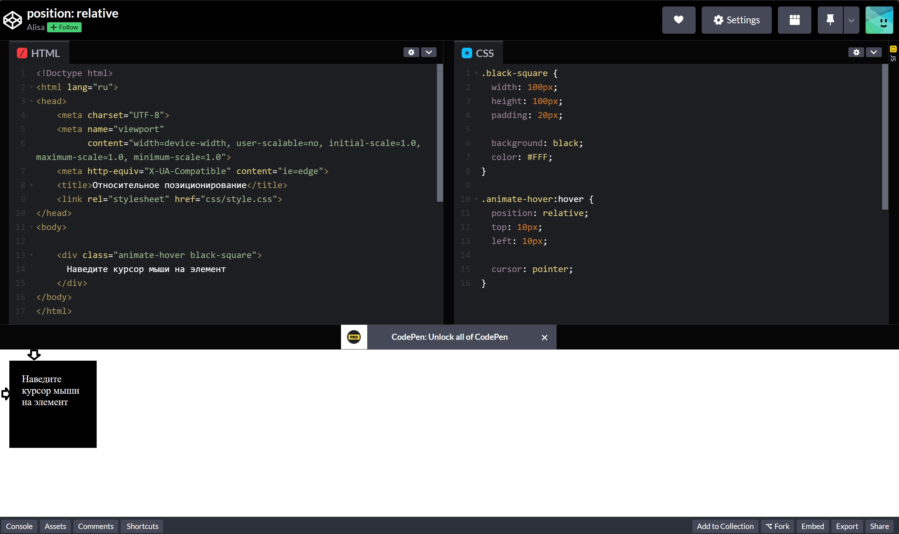
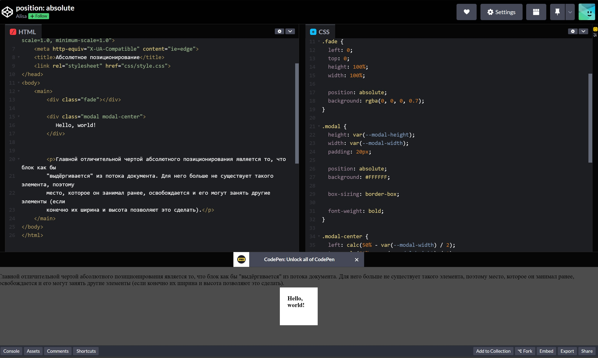
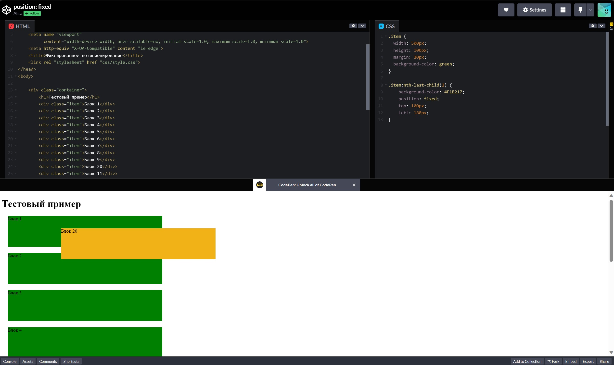
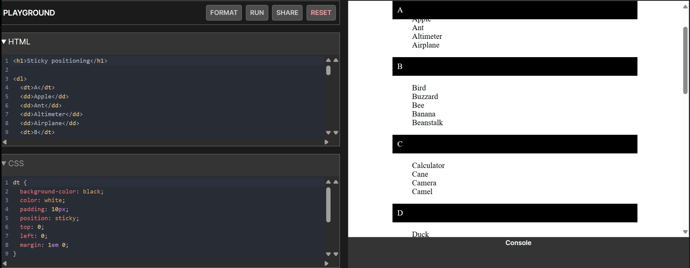

# Week 5 HTML & CSS

## Positioning

###My homework

####Magic gallery

#### Flex

#### Flexboxdefense

#### Flexbox Froggy

### Basic moments

- Static positioning
  

- Relative positioning
  

- Absolute positioning
  

- Fixed positioning
  

- Sticky positioning
  
